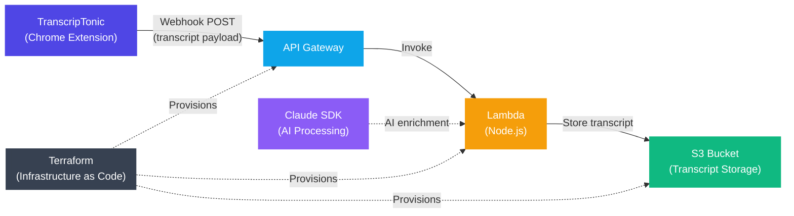

# TranscripTonic Backend

> **Backend infrastructure for [TranscripTonic](https://chromewebstore.google.com/detail/transcriptonic/ciepnfnceimjehngolkijpnbappkkiag?hl=en)** — Simple Google Meet transcripts. Private and open source.

---

## About TranscripTonic

[TranscripTonic](https://chromewebstore.google.com/detail/transcriptonic/ciepnfnceimjehngolkijpnbappkkiag?hl=en) is an open-source Chrome extension that saves transcripts and chat messages from your Google Meet calls, with **private, on-device processing** by default.

**Key features:**
- **Auto mode** — Automatically records transcripts for all meetings
- **Manual mode** — Trigger recording on demand via the CC icon in Google Meet
- **Multi-language support** — Works with all languages supported by Google Meet captions
- **Webhook integration** — Push transcripts to any tool (Google Docs, n8n, custom APIs, etc.)
- **Privacy-first** — No data leaves the device unless a webhook is explicitly configured
- **Universal output** — Transcripts are saved as plain text files
- **Zoom & Microsoft Teams** support in beta

> Source code & issues: [github.com/vivek-nexus/transcriptonic](https://github.com/vivek-nexus/transcriptonic)
> Extension version: v3.3.0 — OPERATIONAL

---

## Architecture

This backend extends TranscripTonic with a cloud layer for **AI-powered transcript processing** and **persistent storage**, provisioned entirely with Terraform.



### Flow description

| Step | Description |
|------|-------------|
| **1. Extension → API Gateway** | TranscripTonic sends the meeting transcript via a configured webhook (HTTP POST) to AWS API Gateway. |
| **2. API Gateway → Lambda** | API Gateway routes the request to the Lambda function for processing. |
| **3. Lambda → S3** | The Lambda function parses and stores the raw transcript in an S3 bucket. |
| **4. Claude SDK → Lambda** | The Lambda function optionally calls the Claude SDK to enrich or summarize the transcript with AI. |
| **Terraform** | Provisions and manages the API Gateway, Lambda function, and S3 bucket as Infrastructure as Code. |

---

## Infrastructure (Terraform)

All AWS resources are managed with [Terraform](https://www.terraform.io/). The planned infrastructure includes:

- **AWS API Gateway** — HTTP endpoint that receives webhook payloads from the extension
- **AWS Lambda** — Serverless function to process and route transcripts; integrates with the Claude SDK for AI enrichment
- **AWS S3** — Durable, scalable storage for transcript files
- **IAM Roles & Policies** — Least-privilege permissions wiring Lambda to S3

### Planned directory structure

```
transcrip-tonic-backend/
├── terraform/
│   ├── main.tf          # Root module — providers & backend config
│   ├── variables.tf     # Input variables
│   ├── outputs.tf       # Output values (API URL, bucket name, etc.)
│   ├── lambda.tf        # Lambda function resource
│   ├── api_gateway.tf   # API Gateway resource
│   ├── s3.tf            # S3 bucket resource
│   └── iam.tf           # IAM roles and policies
├── src/
│   └── handler.js       # Lambda function source code
└── README.md
```

---

## Getting Started

> Prerequisites: [AWS CLI](https://aws.amazon.com/cli/) configured, [Terraform](https://developer.hashicorp.com/terraform/install) installed, and Node.js for the Lambda function.

```bash
# 1. Clone the repository
git clone https://github.com/your-org/transcrip-tonic-backend.git
cd transcrip-tonic-backend

# 2. Initialize Terraform
cd terraform
terraform init

# 3. Review the plan
terraform plan

# 4. Apply infrastructure
terraform apply
```

Once deployed, copy the **API Gateway URL** from the Terraform output and paste it into the TranscripTonic extension under **Settings → Webhooks**.

---

## Related Links

- [TranscripTonic Chrome Extension](https://chromewebstore.google.com/detail/transcriptonic/ciepnfnceimjehngolkijpnbappkkiag?hl=en)
- [TranscripTonic Source Code](https://github.com/vivek-nexus/transcriptonic)
- [Webhook Integration Docs](https://github.com/vivek-nexus/transcriptonic/wiki)
- [Report a Bug](https://github.com/vivek-nexus/transcriptonic/issues)

---

## License

This project is open source. See [LICENSE](./LICENSE) for details.
