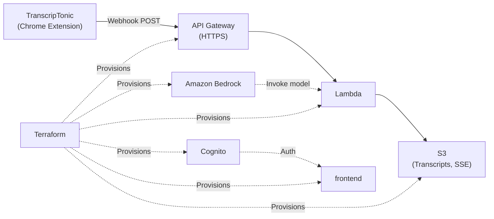

# Architecture

Cloud layer: **webhook ingestion** (API first), then **Lambda**, **S3**, **Amazon Bedrock** (optional AI), **Amazon Cognito** (operator sign-in), **frontend** (HTML/CSS/JS). Infrastructure as code: Terraform.

| Area                | Role                                                    |
| ------------------- | ------------------------------------------------------- |
| **Extension → API** | Webhook POST with transcript payload; HTTPS in transit. |
| **Lambda**          | Parse, store, optionally call Bedrock.                  |
| **S3**              | Transcript objects; encryption at rest (SSE).           |
| **Bedrock**         | Model inference (region/model are deployment choices).  |
| **Cognito**         | Sign-in for the operator UI.                            |
| **frontend**        | Operator UI; host on S3/CloudFront or similar.          |

**Order:** API Gateway first so a webhook base URL exists; Lambda and integrations next.
